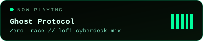
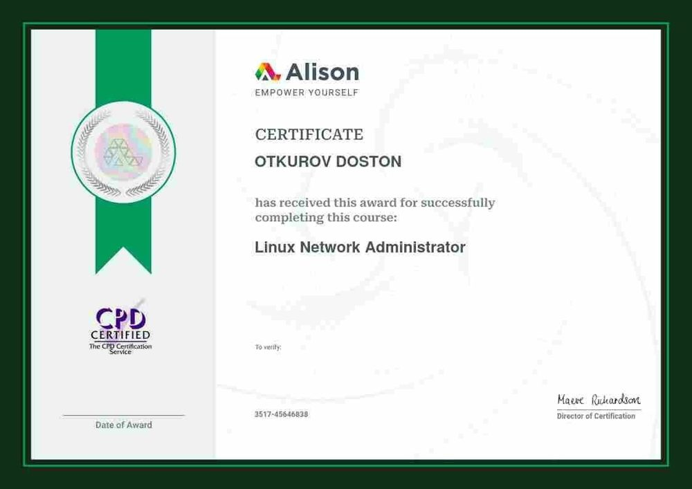
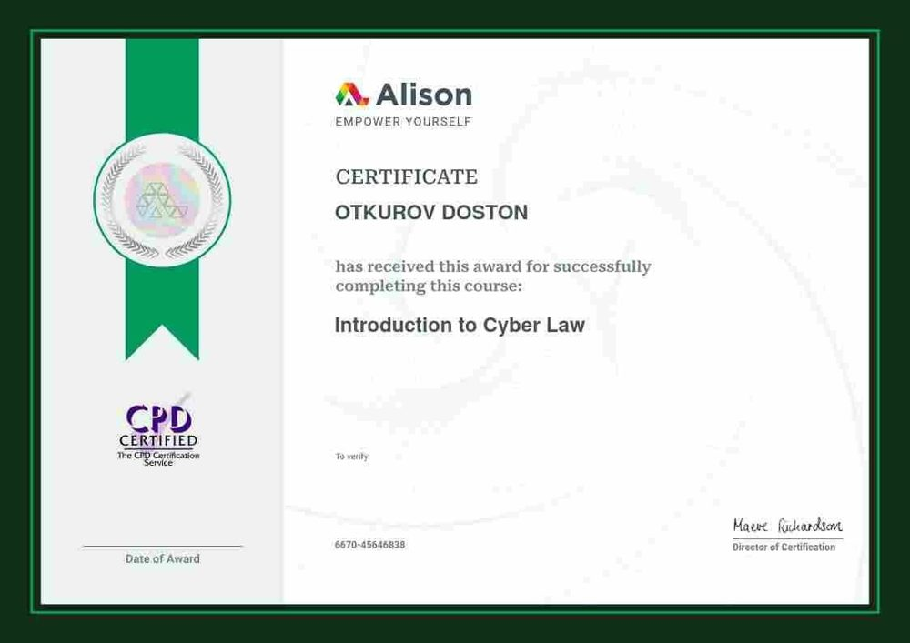
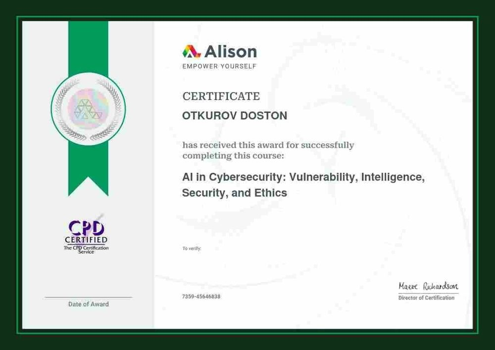
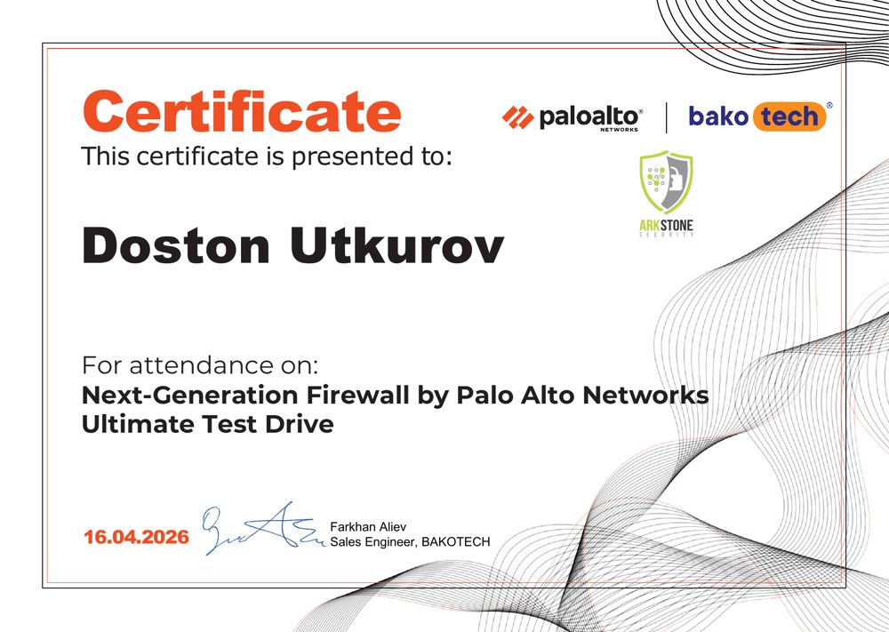
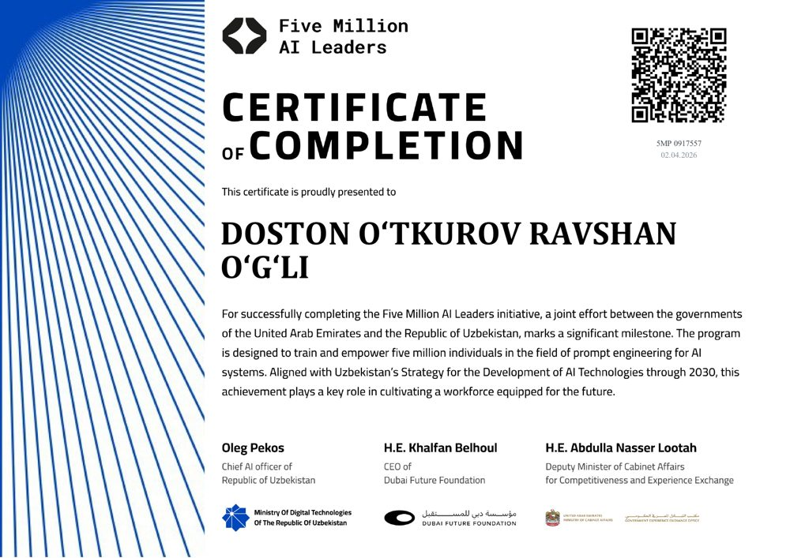
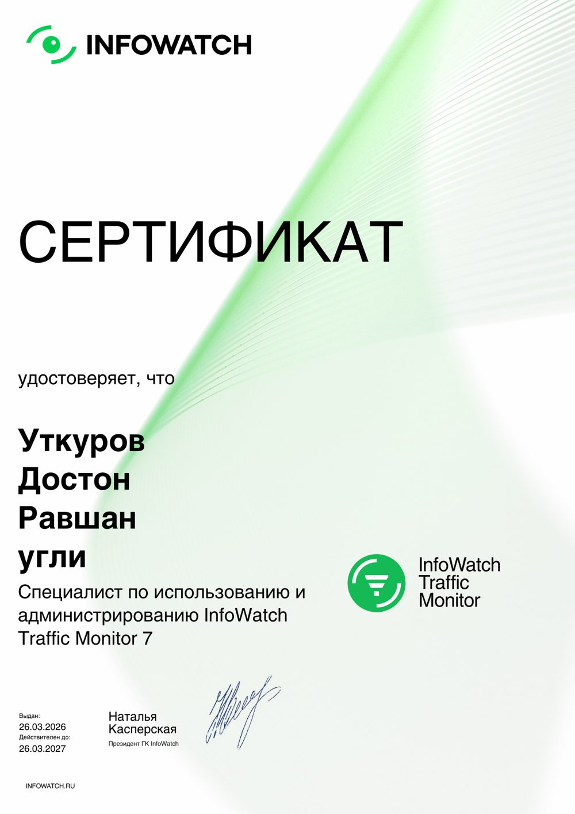

 

<table align="center">
<tr>
<td width="55%" valign="top">

### 👤 callsign: `ZERO-TRACE`

- 🧠 **Full-Stack Developer** · **DevOps** · **Cyber Security** · **AI Engineer**
- 🔭 Currently working at **Griffyn Robotech Pvt. Ltd.**
- 🛡️ Penetration testing, security audits & building automated security tooling
- ⚙️ From backend to infrastructure, from frontend to AI models — full stack, every layer
- 🌱 Currently deepening my skills in **Swift, SwiftUI**, **Three.js** and **AI/ML**
- 🤝 Open to freelance projects
- 💬 Ask me about **React, Next.js, DevOps, Cyber Security, AI**
- 📫 Reach me at **otkurovdoston69@gmail.com**
- ⚡ *"Trust nothing. Verify everything."*

</td>
<td width="45%" valign="top" align="center">

</td>
</tr>
</table>

 

### 🎧 Now Playing

static widget — connect <a href="https://github.com/kittinan/spotify-github-profile">spotify-github-profile</a> for real-time data

 

### 🎬 Featured Video

 

### 🛠️ Tech Stack

 

### 📊 GitHub Analytics

self-hosted via GitHub Actions — see setup notes below

 

### 🐍 Contribution Snake

 

### 📜 Certificates

<table>
<tr>
<td align="center" width="33%">

 <b>Linux Network Administrator</b> Alison
</td>
<td align="center" width="33%">

 <b>Introduction to Cyber Law</b> Alison
</td>
<td align="center" width="33%">

 <b>AI in Cybersecurity: Vulnerability, Intelligence, Security & Ethics</b> Alison
</td>
</tr>
<tr>
<td align="center" width="33%">

 <b>Next-Gen Firewall — Ultimate Test Drive</b> Palo Alto Networks × BakoTech
</td>
<td align="center" width="33%">

 <b>Five Million AI Leaders</b> UAE × Uzbekistan Gov. Initiative
</td>
<td align="center" width="33%">

 <b>InfoWatch Traffic Monitor 7 Specialist</b> InfoWatch
</td>
</tr>
<tr>
<td align="center" width="33%">

 <b>Software Development</b> Training Program, Tashkent
</td>
<td></td>
<td></td>
</tr>
</table>

 

### 🎮 Gaming

 

### 🤝 Connect

  

  

