 

<table align="center">
<tr>
<td width="60%" valign="top">

### 👨‍💻 Men haqimda

- 🔭 Hozirda **Griffyn Robotech Pvt. Ltd.**da ishlayapman
- 🌱 Frontend development bo'yicha rivojlanishda davom etmoqdaman
- 🤝 Freelance loyihalar uchun ochiqman
- 🎯 Hozirgi paytda **Swift, SwiftUI** va **Three.js** o'rganmoqdaman
- 💬 Menga **React.js, Next.js, Three.js** haqida savol berishingiz mumkin
- 📫 Bog'lanish: **otkurovdoston69@gmail.com**
- ⚡ Qiziqarli fakt: dizayn va kod — men uchun bir xil san'at

</td>
<td width="40%" valign="top" align="center">

</td>
</tr>
</table>

 

### 🛠️ Tech Stack

 

### 📊 GitHub Analytics

 

### 🐍 Contribution Snake

 

### 🤝 Bog'lanish

  

  

